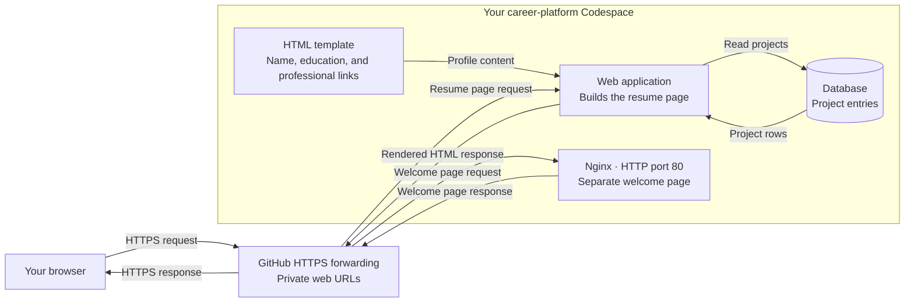
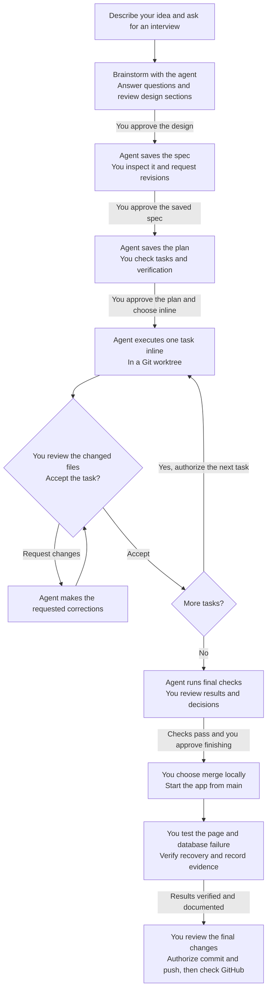

# Build your resume site in Codespaces

Session 05 · September 15, 2026

Today you will turn a small request into a working web application. Your page
will show profile basics and read projects from a database. You will also prove that
you can explain a database failure, recover from it, and preserve your work.

The coding agent can propose and write files. You remain responsible for the
requirements, the decisions, the review, the commands you run, and the evidence.
Ask the agent to explain any change you do not understand.

## The application we are building

Your resume page combines profile basics with projects read from a database.
The browser reaches the application through a private Codespaces forwarded URL.




Nginx serves its own welcome page today. The application reads project entries
from the database, which stays private. You will choose the database engine
during the design interview.

## Our route through class


| Minutes | Work                                                                   | Checkpoint                                          |
| ------- | ---------------------------------------------------------------------- | --------------------------------------------------- |
| 0–10    | Create the repository and first Codespace                              | Correct repository is open                          |
| 10–17   | Check and open GitHub Copilot CLI                                      | Agent opens in the repository                       |
| 17–20   | Install Superpowers in your chosen agent                               | Plugin is installed and enabled                     |
| 20–25   | Describe your idea and prepare your profile facts                      | You can explain who the site is for                 |
| 25–40   | Brainstorm, approve the design, inspect the spec, and review the plan  | Saved spec and plan are approved before code        |
| 40–70   | Build one task at a time, configure database access, and merge locally | Working application in the main checkout            |
| 70–85   | Test the page, stop the database, and verify recovery                  | Page changes 200 → 503 → 200                        |
| 85–100  | Document evidence, review, push, and stop the Codespace                | Actual spec, plan, code, and evidence are on GitHub |


The failure and recovery work from minutes 70–85 is protected. The final 15
minutes are also protected for documentation and Git.

## 1. Create one portfolio repository

Everyone starts by creating a new `career-platform` repository on GitHub:

1. Select **New repository** from your GitHub account.
2. Name it `career-platform` and set it to **Public**.
3. Add a README and choose the **Python** `.gitignore` template.
4. Create the repository, then create a Codespace on `main`.

In the Codespace terminal, check which repository is open:

```bash
pwd
git remote -v
```

Expect `/workspaces/career-platform` and your own repository URL.

Checkpoint: explain which work GitHub stores and which state exists only inside
the Codespace.

## 2. Open GitHub Copilot CLI

Today we use GitHub Copilot CLI in the Codespace terminal. Copilot Chat in the
editor and Copilot CLI are separate interfaces. Check the terminal tool first:

```bash
copilot --version
```

Start the agent from `/workspaces/career-platform`:

```bash
copilot
```

Sources: [CLI installation](https://docs.github.com/en/copilot/how-tos/copilot-cli/set-up-copilot-cli/install-copilot-cli)
and [student access](https://docs.github.com/en/copilot/how-tos/copilot-on-github/set-up-copilot/enable-copilot/set-up-for-students).

Checkpoint: Copilot opens and identifies `/workspaces/career-platform` as the
project directory.

## 3. Install Superpowers

Open a separate Bash terminal in the Codespace. Register the Superpowers
marketplace, install the plugin, and list installed plugins:

```bash
copilot plugin marketplace add obra/superpowers-marketplace
copilot plugin install superpowers@superpowers-marketplace
copilot plugin list
```

Confirm Superpowers is listed.

End the earlier Copilot session by running

```
/exit
```

then run `copilot` from the repository again so the new session loads it.

Confirm Superpowers is installed:

```
Is Superpowers installed?
```

Sources: [Superpowers for Copilot CLI](https://github.com/obra/superpowers/blob/main/README.md#github-copilot-cli)
and [GitHub's plugin instructions](https://docs.github.com/en/copilot/how-tos/copilot-cli/customize-copilot/plugins-finding-installing).

Checkpoint: Superpowers is installed, and a fresh Copilot session is open in
`/workspaces/career-platform`.

## 4. Start with an idea

You want a website that introduces you to potential employers and shows your
work. Have your name, education, and professional links ready. You can decide
how to organize them during the interview and use honest placeholders where needed.

The interview will help you decide what to build. The saved spec records
those decisions.

Use the following prompts one at a time. Read the response, answer the agent's
questions, and inspect saved files before approving the next gate. Use the
Copilot conversation for each prompt.

At every gate, ask yourself:

1. What am I asking the agent to do?
2. How will I check its work?
3. What will I accept, change, or reject, and why?


### Our workflow with Copilot CLI and Superpowers

You approve the design, saved spec, and saved plan before implementation begins.
During today's inline execution, the agent stops after each task for your review.




At each approval gate, ask for revisions until the saved work matches your
decisions. A failed check returns to debugging and verification before continuing.

## 5. Brainstorm the design

```text
Help me design a database-driven personal resume website that can grow into a career platform.
Interview me one question at a time with multiple-choice options to gather enough context to write a spec. Do not build anything until I approve the spec.
```

Answer from your own background and goals. Explain who should visit the site,
what they should learn, and what content you have today. Tell the agent when
you need a placeholder, and ask it to explain unfamiliar choices.

As technical questions arise, explain that you are working in Codespaces and
have practiced running MySQL. Ask the agent to explain database options before
choosing one. For this lab, use a local database server you can stop and restart.
Nginx will keep its separate welcome page today.

Before approving the design, discuss any of these questions the interview missed:

- What should visitors see, and which unfinished sections need labeled placeholders?
- Which database engine fits the site, and what project information will it store?
- What should remain visible when the database stops, and how will we verify recovery?
- How will the application connect to the database and read its projects?

For our failure exercise, agree that the page keeps the profile visible, returns
HTTP 503 when projects are unavailable, and recovers to HTTP 200 when the database restarts.
Ask the agent to explain those status codes before approving that behavior.
The design should also keep web forwarding private and the database unforwarded.

The agent should propose two or three approaches and explain their tradeoffs.
Choose one, then review the design section by section. Say "yes" or explain
what should change and why. All sections need your approval before the spec.

Checkpoint: explain your database choice and which part of the page depends on it.
No setup scripts or application code should exist yet.

## 6. Approve the design and write the spec

After reviewing every design section:

```text
I approve the design. Write the spec.
Do not write the implementation plan until I approve the spec.
```

Have the agent save the spec in `docs/superpowers/specs/` and commit it.
Open that file for the next step.

## 7. Inspect and revise the spec

Open the saved spec in Codespaces. Check the purpose, profile content, request
path, database behavior, and verification requirements against your interview
decisions and today's lab constraints.
Check for missing decisions, contradictions, and unclear requirements.

Ask for changes in plain words. For example:

```text
Keep my profile visible when the database is unavailable.
Update the spec and show me what changed.
```

Request the changes your spec needs, then read the saved revision before approving.

## 8. Approve the spec and write the plan

```text
I approve the spec. Write the implementation plan.
For each task, say what done looks like and how I check it.
If the spec leaves a choice open, ask me before deciding.
Do not build until I approve the plan.
```

Open the saved plan in `docs/superpowers/plans/`.

## 9. Review the plan

Open the saved plan and check these three things:

1. Every spec requirement has a task and an observable check.
2. Each task gives enough detail to carry out and check.
3. File, function, and configuration names match across tasks.

The plan should create the project instructions, install services, create the
database and reader, build the page, and verify the result. Project instructions
belong in `AGENTS.md`, which Copilot CLI reads. Include the password setup in
Step 11 before the agent creates the database account or connects the application.

Ask for corrections, then inspect the saved plan before approving execution.

## 10. Approve the plan and begin inline execution

Choose inline execution so the agent works through the plan in this conversation.
Have it stop after each task so you can review the changes.

```text
I approve the plan. Execute inline.
Do only the first task.
Show me the changed files and stop.
```

The agent should commit the approved spec and plan before building in a Git
worktree, a separate working folder on its own branch. Have it show you that
folder, then open the changed files there and compare them with your spec.
Ask for corrections before moving on.

## 11. Complete the remaining tasks

Before the database task, complete the password setup below. For each task,
review the previous changes, then say:

```text
Do the next task in the plan.
Show me the changed files and stop.
```


### Set up database access

Now that you have chosen a database, ask the agent to explain the application's
account, permissions, and password setting. Use a read-only account for project
queries and keep its password in a Codespaces secret, separate from your code.

1. In your GitHub account settings, open **Codespaces**, then **New secret**.
2. Use the environment variable name agreed in your plan, such as `DB_PASSWORD`.
3. Enter a new lab password, save it in your password manager, and grant access
  to `career-platform`. Keep the value out of chat, screenshots, and Git.
4. Stop and restart this Codespace to load the secret. Reopen the agent in its
  worktree and ask it to continue the saved plan one task at a time.

Have the agent check that the variable is present without displaying its value.
Creating a secret stores the password. The database task must still create the
account with that password and give it the reviewed permissions.

Source: [GitHub Codespaces secrets](https://docs.github.com/en/codespaces/managing-your-codespaces/managing-your-account-specific-secrets-for-github-codespaces).

### Review the database and application tasks

At the database task, locate `CREATE TABLE`, `INSERT`, `SELECT`, and `GRANT` in
the generated files. Explain what each does, then inspect the reader's query
result. It should show the project you agreed to include, with any placeholder
clearly labeled.

At the application task, locate the request handler, database connection, SQL
query, and HTML response. Ask why each connection closes and how the next
request recovers after a database failure.

Read the project instructions, setup files, and verification results. Compare
them with your approved spec, including the read-only database account, secrets
from the environment, and HTTP 503 when the database is down. Ask for fixes if they differ.

## 12. Finish the plan and merge locally

Review the agent's final checks and decisions. Resolve any failures, then bring
the completed work into `main`:

```text
Merge locally. Do not push yet.
```

Confirm the files are in the original `career-platform` checkout on `main`.
Then ask:

```text
Start the application from main using the reviewed setup.
Give me its URL, startup command, and how to stop it.
Leave the database and Nginx running for my checks.
```

Have the agent prepare the virtual environment in `main` and show you the
running application and its logs. Git does not transfer the worktree's `.venv`.

## 13. Check the page, fail the database, and recover

Leave the application running. Use a separate Bash terminal for your checks.
The commands below illustrate a Flask application with MySQL. Have the agent
adapt them to your chosen database engine, application port, and account and
table names before running them. Review the changes together. The checks remain
the same: read the data, stop the database, observe the failure, and recover.

At the Bash prompt, connect as the application's reader:

```bash
mysql -h 127.0.0.1 -P 3306 -u portfolio_reader -p
```

Enter your database password privately. At `mysql>`, inspect the row and grants,
then return to Bash:

```sql
SELECT id, title, description FROM portfolio.projects ORDER BY id;
SHOW GRANTS FOR CURRENT_USER;
exit
```

At Bash, check the application and Nginx:

```bash
curl -i http://127.0.0.1:5000/
curl -I http://127.0.0.1/
```

Expect HTTP 200 from both. The application response must match the SQL row.
Forward ports 5000 and 80 as **Private** and open their browser URLs. Leave
MySQL port 3306 unforwarded.

Use the application diagram above to trace both request paths. Explain why
Python is both a server to the browser and a client to MySQL.

Predict what will fail, then stop MySQL and repeat the requests:

```bash
sudo service mysql stop
curl -I http://127.0.0.1/
curl -i http://127.0.0.1:5000/
ss -lnt
```

Nginx should still return 200. Flask should return 503, retain your profile, and
show the unavailable-projects message you approved. Its port remains open while
MySQL's 3306 listener disappears. Inspect the application log and refresh the browser.
Explain the evidence before repairing anything.

Restart MySQL and repeat the failed request:

```bash
sudo service mysql start
curl -i http://127.0.0.1:5000/
```

Expect HTTP 200 and the actual project row without restarting the application.
If the result differs, give the agent your observations and ask it to investigate.
Review its explanation and fix, then repeat the full check.

Checkpoint: explain your observed 200 → 503 → 200 sequence and why Nginx kept
working.

## 14. Record the evidence, push, and check GitHub

Give the agent your actual observations, then ask:

```text
Record my checks and results in docs/troubleshooting.md.
Update the plan's task statuses and the migration notes.
Show me the changes before committing or pushing.
```

Read the files and diff. Check that no result is invented and no secret appears.
The README should identify startup steps, and the migration notes should explain
what Thursday's VM needs beyond the files in Git.

After reviewing:

```text
Commit the reviewed work and push main to GitHub.
Give me the GitHub links to the repository, spec, and plan.
```

Open those links and verify that the actual files are the versions you reviewed.
Check the repository in a signed-out browser window. A push saves tracked files.
Running services, secrets, and live database data stay in the Codespace.

Before Thursday, September 17, complete [Prepare for the Azure VM lesson](azure-vm-preparation.md).
It covers Azure activation, Claude Code or Codex setup, Superpowers, and Azure
CLI sign-in. Thursday's agent will run in this same Codespace.

Stop the Codespace at [https://github.com/codespaces](https://github.com/codespaces) and verify its stopped
status. Keep it for Thursday because Git does not preserve its live database.
Your next step is to complete the preparation checklist and report any blockers.

## What to type at each gate


| Gate                      | What you say after reviewing                                  |
| ------------------------- | ------------------------------------------------------------- |
| Start                     | Use the idea and interview prompt in Step 5.                  |
| Design sections           | "Yes" or "No, because..."                                     |
| Write the spec            | "I approve the design. Write the spec."                       |
| Revise the spec           | "Change A to B."                                              |
| Write the plan            | "I approve the spec. Write the implementation plan."          |
| Revise the plan           | "Fix task 3."                                                 |
| Begin today's build       | "I approve the plan. Execute inline. Do only the first task." |
| Continue                  | "Do the next task. Show me the changed files and stop."       |
| Finish                    | "Merge locally. Do not push yet."                             |
| Publish the reviewed work | "Commit the reviewed work and push main to GitHub."           |
