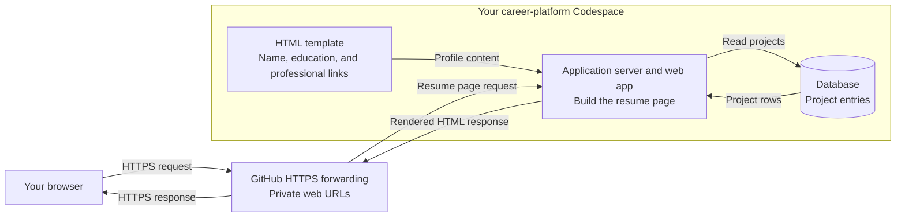
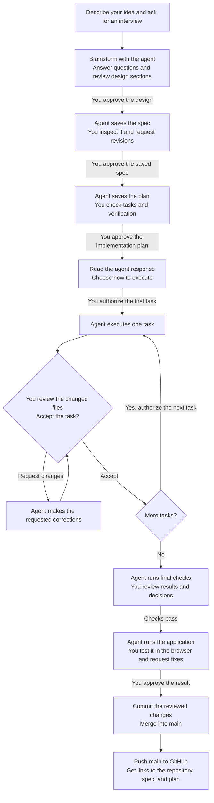

# Build your resume site in Codespaces

Session 05 · September 15, 2026

Today you will turn a small request into a working web application. Your page
will show profile basics and read projects from a database. You will review the
agent's work and save the application, spec, and plan on GitHub.

The coding agent can propose and write files. You remain responsible for the
requirements, the decisions, the review, the commands you run, and the evidence.
Ask the agent to explain any change you do not understand.

## The application we are building

Your resume page combines profile basics with projects read from a database.
The browser reaches the application through a private Codespaces forwarded URL.




The forwarded URL connects directly to your application server. The application
reads project entries from a private database. You will choose the database
engine during the design interview.

## Our route through class


| Minutes | Work                                                                  | Checkpoint                                     |
| ------- | --------------------------------------------------------------------- | ---------------------------------------------- |
| 0–10    | Create the repository and first Codespace                             | Correct repository is open                     |
| 10–17   | Activate Copilot, check credits, and open the CLI                     | Agent opens in the repository                  |
| 17–20   | Install Superpowers in your chosen agent                              | Plugin is installed and enabled                |
| 20–25   | Describe your idea and prepare your profile facts                     | You can explain who the site is for            |
| 25–40   | Brainstorm, approve the design, inspect the spec, and review the plan | Saved spec and plan are approved before code   |
| 40–85   | Build one task at a time and test the application in the browser      | You can see and use the application            |
| 85–100  | Commit, merge to main, and push to GitHub                              | GitHub links to the repository, spec, and plan |


Keep the final 15 minutes for merging to `main` and publishing the work to GitHub.

## 1. Create one portfolio repository

Everyone starts by creating a new `career-platform` repository on GitHub:

1. Select **New repository** from your GitHub account.
2. Name it `career-platform` and set it to **Public**.
3. Add a README and choose the **Python** `.gitignore` template.
4. Create the repository, then create a Codespace on `main`.

In the Codespace terminal, check which repository is open:

```bash
pwd
git remote -v
```

Expect `/workspaces/career-platform` and your own repository URL.

Checkpoint: explain which work GitHub stores and which state exists only inside
the Codespace.

## 2. Activate your benefit and open GitHub Copilot CLI

Check your free education benefit before opening the agent:

1. Open [Education benefits](https://github.com/settings/education/benefits) and
  follow the prompts to activate Copilot. You can also check the
   [free activation page](https://github.com/github-copilot/free_signup).
   Complete activation if it confirms free access. If it only offers a paid
   plan or trial, tell the instructor.
2. Open [Copilot settings](https://github.com/settings/copilot) and note your
  active plan name.
3. Open [AI usage](https://github.com/settings/billing/ai_usage) and record your
  included credit allowance and credits used. Tell the instructor if your
   allowance is higher than 200 so we can compare accounts.

Education approval and Copilot activation are separate steps. Your benefit can
take several days to apply. [Activation instructions](https://docs.github.com/en/copilot/how-tos/copilot-on-github/set-up-copilot/enable-copilot/set-up-for-students).

Today we use GitHub Copilot CLI in the Codespace terminal. Copilot Chat in the
editor and Copilot CLI are separate interfaces. Check the terminal tool first:

```bash
copilot --version
```

Start the agent from `/workspaces/career-platform`:

```bash
copilot
```

Sources: [CLI installation](https://docs.github.com/en/copilot/how-tos/copilot-cli/set-up-copilot-cli/install-copilot-cli)
and [student access](https://docs.github.com/en/copilot/how-tos/copilot-on-github/set-up-copilot/enable-copilot/set-up-for-students).

Checkpoint: Copilot opens and identifies `/workspaces/career-platform` as the
project directory.

## 3. Install Superpowers

Open a separate Bash terminal in the Codespace. Register the Superpowers
marketplace, install the plugin, and list installed plugins:

```bash
copilot plugin marketplace add obra/superpowers-marketplace
copilot plugin install superpowers@superpowers-marketplace
copilot plugin list
```

Confirm Superpowers is listed.

End the earlier Copilot session by running

```
/exit
```

then run `copilot` from the repository again so the new session loads it.

Confirm Superpowers is installed:

```
Is Superpowers installed?
```

Sources: [Superpowers for Copilot CLI](https://github.com/obra/superpowers/blob/main/README.md#github-copilot-cli)
and [GitHub's plugin instructions](https://docs.github.com/en/copilot/how-tos/copilot-cli/customize-copilot/plugins-finding-installing).

Checkpoint: Superpowers is installed, and a fresh Copilot session is open in
`/workspaces/career-platform`.

### Check your usage

GitHub's published Copilot Student allowance is **200 GitHub AI Credits per
month**, checked September 15, 2026. Use the allowance shown in your account
after activation. Credits are shared across Copilot AI features, and each prompt
can consume a different amount. [Student allowance](https://github.com/orgs/community/discussions/189268).

Inside the Copilot conversation, enter:

```text
/usage
```

This shows credits consumed in the current session. Record the amount now,
before starting the build, and at the end of class. Record each session
separately if you start a new one. [Usage command](https://docs.github.com/en/copilot/how-tos/copilot-cli/use-copilot-cli/overview#context-management).

## 4. Start with an idea

You want a website that introduces you to potential employers and shows your
work. Have your name, education, and professional links ready. You can decide
how to organize them during the interview and use honest placeholders where needed.

The interview will help you decide what to build. The saved spec records
those decisions.

Use the following prompts one at a time. Read the response, answer the agent's
questions, and inspect saved files before approving the next gate. Use the
Copilot conversation for each prompt.

At every gate, ask yourself:

1. What am I asking the agent to do?
2. How will I check its work?
3. What will I accept, change, or reject, and why?


### Our workflow with Copilot CLI and Superpowers

You approve the design, saved spec, and saved plan before implementation begins.
After approving the plan, read the agent's response and choose how to execute.
For today's build, ask it to stop after each task for your review.




At each approval gate, ask for revisions until the saved work matches your
decisions. A failed check returns to debugging and verification before continuing.

## 5. Brainstorm the design

```text
Help me design a database-driven personal resume website that can grow into a career platform.
Interview me one question at a time with multiple-choice options to gather enough context to write a spec. Do not build anything until I approve the spec.
```

Look for `skill(brainstorming)` in Copilot's response to confirm that the
Superpowers brainstorming skill has started.

Answer from your own background and goals. Explain who should visit the site,
what they should learn, and what content you have today. Tell the agent when
you need a placeholder, and ask it to explain unfamiliar choices.

As technical questions arise, explain that you are working in Codespaces and have practiced running MySQL. Ask the agent to explain database options before choosing one. For this lab, use a local database server you can stop and restart.

Before approving the design, discuss any of these questions the interview missed:

- What should visitors see, and which unfinished sections need labeled placeholders?
- Which database engine fits the site, and what project information will it store?
- What should remain visible when the database stops, and how will we verify recovery?
- How will the application connect to the database and read its projects?

The agent should propose two or three approaches and explain their tradeoffs.
Choose one, then review the design section by section. Say "yes" or explain
what should change and why. All sections need your approval before the spec.

Checkpoint: explain your database choice and which part of the page depends on it.
No setup scripts or application code should exist yet.

## 6. Approve the design and write the spec

After reviewing every design section:

```text
I approve the design. Write the spec.
Do not write the implementation plan until I approve the spec.
```

Have the agent save the spec in `docs/superpowers/specs/` and commit it.
Open that file for the next step.

## 7. Inspect and revise the spec

Open the saved spec in Codespaces. Check the purpose, profile content, request
path, database behavior, and verification requirements against your interview
decisions and today's lab constraints.
Check for missing decisions, contradictions, and unclear requirements.

Ask for changes in plain words. For example:

```text
Keep my profile visible when the database is unavailable.
Update the spec and show me what changed.
```

Request the changes your spec needs, then read the saved revision before approving.

## 8. Approve the spec and write the plan

```text
I approve the spec. Write the implementation plan.
For each task, say what done looks like and how I check it.
If the spec leaves a choice open, ask me before deciding.
Do not build until I approve the plan.
```

Open the saved plan in `docs/superpowers/plans/`.

## 9. Review the plan

Open the saved plan and check these three things:

1. Every spec requirement has a task and an observable check.
2. Each task gives enough detail to carry out and check.
3. File, function, and configuration names match across tasks.

The plan should create the project instructions, install services, create the
database and reader, build the page, and verify the result. Project instructions
belong in `AGENTS.md`, which Copilot CLI reads.

Ask for corrections, then inspect the saved plan before approving execution.

## 10. Approve the implementation plan

```text
I approve the implementation plan.
```

Read the agent's response before continuing. Discuss any execution choices it
presents, then decide how to proceed in Step 11.

## 11. Choose how to execute and begin the tasks

Use the agent's response to discuss how it will carry out the plan. For today's
build, ask it to work in this conversation and stop after each task for review.

When you are ready to begin:

```text
Do only the first task in the plan.
Show me the changed files and stop.
```

Open the changed files and compare them with your spec. If the agent uses a
Git worktree, a separate working folder on its own branch, have it show you
that folder so you review the files there. Ask for corrections before moving on.

After reviewing each task:

```text
Do the next task in the plan.
Show me the changed files and stop.
```


## 12. Run and test the application

After all tasks are done, review the agent's final checks. Resolve any failures,
then ask:

```text
Run the application for me and give me the URL so I can test it in my browser.
```

If the agent used a worktree, have it run that version for your review.
Let Copilot handle startup and the preview link.

Open the link and compare the website with your approved spec:

- Check your profile content and the projects displayed from the database.
- Try the links and any features you asked for.
- Narrow the browser window to check the layout.

Tell the agent what needs changing, then refresh and check again.

## 13. Commit and merge the reviewed work into main

The agent may have built the application on a separate branch, possibly in a
worktree. Merging brings those changes into `main`, the version we will publish
and use for Thursday's Azure migration. Commit any remaining reviewed changes
on the working branch first, because a merge brings together committed work.

Once you approve the browser result, ask:

```text
Commit any remaining reviewed changes, then merge into main. Do not push yet.
```

If the work is already on `main`, no merge is needed. Have the agent confirm
that `main` contains the version you reviewed.

## 14. Push to GitHub

```text
Push the main branch to GitHub.
Give me the GitHub links to the repository, spec, and plan.
```


## What to type at each gate


| Gate                      | What you say after reviewing                                                     |
| ------------------------- | -------------------------------------------------------------------------------- |
| Start                     | Use the idea and interview prompt in Step 5.                                     |
| Design sections           | "Yes" or "No, because..."                                                        |
| Write the spec            | "I approve the design. Write the spec."                                          |
| Revise the spec           | "Change A to B."                                                                 |
| Write the plan            | "I approve the spec. Write the implementation plan."                             |
| Revise the plan           | "Fix task 3."                                                                    |
| Approve the plan          | "I approve the implementation plan."                                             |
| Choose how to execute     | Read and respond to the agent's execution choices.                               |
| Begin today's build       | "Do only the first task in the plan. Show me the changed files and stop."        |
| Continue                  | "Do the next task. Show me the changed files and stop."                          |
| Preview                   | "Run the application for me and give me the URL so I can test it in my browser." |
| Commit and merge          | "Commit any remaining reviewed changes, then merge into main. Do not push yet." |
| Publish the reviewed work | "Push the main branch to GitHub."                                               |
